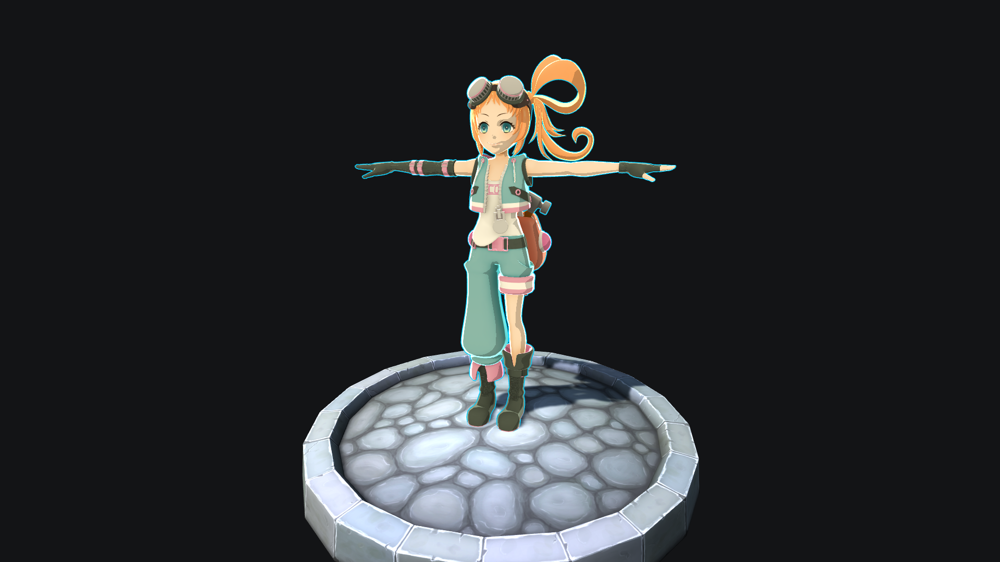

# Toon shader

## Introduction

Toon shader which can be used for cartoon/anime style games, cutscenes, films.

<picture>
  <source media="(prefers-color-scheme: dark)" srcset="GIF/BigPicture.png">
  
</picture>

## Feature list :sparkles:
- Cel shading
- Ambient light
- Rim light
- Outlining
- Normal mapping
- Cascade shadows
- GPU Instancing

## Supported light types :bulb:
- **Per-pixel** directional
- **Per-vertex** point
- **SH** point

## Per-pixel directional light :heavy_check_mark:
<picture>
  <source media="(prefers-color-scheme: dark)" srcset="GIF/DirLight.gif">
  
</picture>

## Per-vertex point lights :heavy_check_mark:
<picture>
  <source media="(prefers-color-scheme: dark)" srcset="GIF/PointLight.gif">
  
</picture>

## GPU Instancing :warning:
Unity uses GPU instancing for GameObjects that share the same mesh and material. To instance a mesh and material:

- The material’s shader must support GPU instancing. Unity’s Standard Shader supports GPU instancing, as do all surface shaders.
- The mesh must come from one of the following sources, grouped by behavior:
  - A MeshRenderer component or a Graphics.RenderMesh call.                                
Behavior: Unity adds these meshes to a list and then checks to see which meshes it can instance.
**Unity does not support GPU instancing for SkinnedMeshRenderers or MeshRenderer components attached to GameObjects that are SRP Batcher compatible** . For more information, see SRP Batcher compatibility.
  - A Graphics.RenderMeshInstanced or Graphics.RenderMeshIndirect call. These methods render the same mesh multiple times using the same shader. Each call to these methods issues a separate draw call. Unity does not merge these draw calls.
